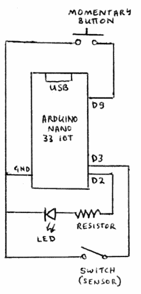

# Sensor Open Detector

Please see the accompanying file [`LICENSE`](LICENSE) for details of the terms of use. Note that this software and project should be considered experimental.

## Overview

This is a simple Arduino sketch written for the [Arduino Nano 33 IoT](https://docs.arduino.cc/hardware/nano-33-iot). It will detect that a sensor is open / closed and is able to notify that the sensor is open / closed. Currently only text-messaging over the [Threema](https://threema.ch) messaging service is supported as a means of notification. The board communicates to the [Threema API](https://gateway.threema.ch/en) using the internet over a local Wifi connection. The software will connect to the configured Wifi access point only when necessary.

The device has a momentary switch. When the sensor is open the momentary switch can be depressed in order to signal that no notification should be sent -- the notification is "paused".

## Wiring

The following diagram shows the very simple wiring for the project;



A suitable sensor that would be practical for detecting a sensor being open might be a [reed switch](https://en.wikipedia.org/wiki/Reed_switch).

## Dependencies

### IDE

The [Arduino IDE](https://www.arduino.cc/en/software) will be required to build the software and to load it onto an Arduino Nano 33 IoT board.

### Device Setup

The Arduino Nano 33 IoT board has a Wifi facility on-board. The firmware should be [upgraded](https://support.arduino.cc/hc/en-us/articles/360013896579-Update-the-firmware-for-WiFiNINA-and-WiFi101) and the certificate for the Threema gateway `msgapi.threema.ch` should be [loaded](https://support.arduino.cc/hc/en-us/articles/360016119219-How-to-add-certificates-to-Wifi-Nina-Wifi-101-Modules-) into the board.

### Arduino Libraries

The following Arduino libraries are required;

* WiFiNINA
* Arduino Low Power
* ArduinoHttpClient

### Threema Handset Application

The people who are receiving messages because the sensor is open will need to have the [Threema](https://threema.ch/en) handset application installed on their mobile phone.

### Threema Message Gateway Account

Having a "Basic" [Gateway ID](https://gateway.threema.ch/en/id-request) account with the Threema Message Gateway service is necessary in order to be able to send textual messages to a user on the Threema handset application.

### Configuration

In order to be able to configure the device, a file `staticsettings.h` should be created. It is included in the `.gitignore` file because it should not be checked in. The file has the following C++ code structure;

```
static Settings* STATICSETTINGS = new Settings(
      "Main Gate",
      new WifiSettings("sicht-5", "abc123def456"),
      new MonitoringSettings(2),
      THREEMA,
      new ThreemaSettings(
        "*XXX2222",
        "987abc654def",
        new ThreemaRecipient("UUUU6666",
          new ThreemaRecipient("KKKK4444", NULL)
        )
      )
    );
```

* Replace `Main Gate` with the name of the sensor that this device will manage
* Replace `sicht-5` with the SSID of your Wifi access point
* Replace `abc123def456` with your Wifi access password
* Replace `2` in `MonitoringSettings(2)` with the number of minutes that the sensor is open before it will notify
* Replace `*XXX2222` with your Threema Gateway ID
* Replace `987abc654def` with your Threema Gateway password

The structure starting `new ThreemaRecip...` is a linked list of the Threema recipients who will receive notifications when the sensor is left open. Each recipient is identified by their Threema ID shown in this example by `UUUU6666` and `KKKK4444`.
